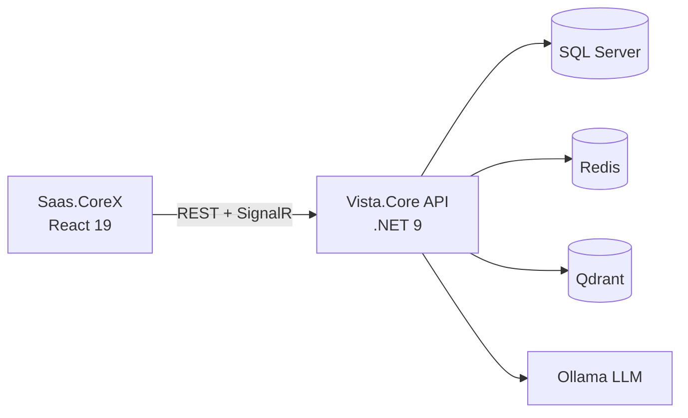

# Vista.Core

[](https://github.com/Daddarios/vista-saas-backend/actions/workflows/ci.yml)


## 🇩🇪 Deutsch

**Vista.Core** ist ein mandantenfähiges (multi-tenant) **CRM / SaaS-Backend** für kleine und mittlere Unternehmen. Es basiert auf .NET 9 Web API und verwaltet Kunden, Projekte, Support-Tickets, Abonnements und Zahlungen. Integriert ist **ViKa**, ein vollständig lokal laufender KI-Assistent (keine Internetabhängigkeit).

> **Live-Demo (Frontend):** [vcorex-demo](https://daddarios.github.io/vcorex-demo/) — React 19 + Vite
> Die Demo ist eine statische Version mit Mock-Daten; es wird nichts gespeichert oder gelöscht.

### Funktionen

- **Kunden- & Ansprechpartnerverwaltung** — Paginierung, Suche, Logo-Upload
- **Projektverfolgung** — Statusverwaltung (nicht gestartet / in Bearbeitung / abgeschlossen / pausiert)
- **Ticketsystem** — Priorität, Status, Antwortverlauf, E-Mail- + Echtzeitbenachrichtigung
- **Abonnements & Zahlungen** — Planverwaltung (Entwurf)
- **Dashboard & Berichte** — Kennzahlen im Überblick
- **Echtzeit-Chat** — Chat mit mehreren Räumen (SignalR)
- **Sichere Authentifizierung** — JWT + Refresh Token + 2FA per E-Mail
- **Rollenbasierte Berechtigungen** — 5 Stufen (SuperAdmin → nur Lesen)
- **Multi-Tenant** — Daten jedes Mandanten isoliert
- **ViKa KI-Assistent** — Fragen & Antworten zu Unternehmensdaten per RAG; Daten verlassen das System nicht

### Tech Stack (DE)

| Ebene | Technologie |
| --- | --- |
| Backend | .NET 9 · ASP.NET Core Web API · EF Core 9 |
| Datenbank | Microsoft SQL Server 2022 |
| Identität | ASP.NET Core Identity · JWT · 2FA (Redis) |
| Echtzeit | SignalR |
| KI / RAG | Semantic Kernel · Kernel Memory · Ollama (`llama3.2:3b`, `nomic-embed-text`) · Qdrant |
| Sonstiges | Redis · MailKit · FluentValidation · Serilog · Swagger |
| Tests | xUnit · EF Core InMemory |
| DevOps | Docker Compose · GitHub Actions · Azure Container Registry |

### Schnellstart

```bash
git clone https://github.com/Daddarios/vista-saas-backend.git
cd vista-saas-backend
docker compose up -d --build
```

Swagger UI: <http://localhost:8080/swagger>

> In der `.env`-Datei müssen `MSSQL_SA_PASSWORD`, `Jwt__Key` und `SmtpSettings__*` gesetzt werden.

---

## 🇹🇷 Türkçe

**Vista.Core**, küçük ve orta ölçekli işletmeler için geliştirilen çok kiracılı (multi-tenant) bir **CRM / SaaS backend** uygulamasıdır. .NET 9 Web API üzerine kuruludur; müşteri, proje, destek bileti, abonelik ve ödeme süreçlerini yönetir. İçinde **ViKa** adlı, tamamen yerel'de & lokal'de çalışan (internete bağımlı olmayan) bir yapay zekâ asistanı bulunur.

> **Canlı Demo (Frontend):** [vcorex-demo](https://daddarios.github.io/vcorex-demo/) — React 19 + Vite
> Demo, mock (sahte) verilerle çalışan statik bir sürümdür; veri kaydedilmez veya silinmez.

### Ne Yapıyor?

- **Müşteri & iletişim kişisi yönetimi** — sayfalama, arama, logo yükleme
- **Proje takibi** — durum yönetimi (başlamadı / devam ediyor / tamamlandı / duraklatıldı)
- **Destek bileti sistemi** — öncelik, durum, yanıt zinciri, e-posta + gerçek zamanlı bildirim
- **Abonelik & ödeme kayıtları** — plan yönetimi (taslak)
- **Dashboard & raporlar** — özet istatistikler
- **Gerçek zamanlı chat** — çok odalı sohbet (SignalR)
- **Güvenli kimlik doğrulama** — JWT + Refresh Token + e-posta ile 2FA
- **Rol bazlı yetkilendirme** — 5 seviye (SuperAdmin → salt okunur)
- **Multi-tenant** — her kiracının verisi izole
- **ViKa AI asistanı** — şirket verisi üzerinde RAG ile soru-cevap; veri dışarı çıkmaz

### Tech Stack (TR)

| Katman | Teknoloji |
| --- | --- |
| Backend | .NET 9 · ASP.NET Core Web API · EF Core 9 |
| Veritabanı | Microsoft SQL Server 2022 |
| Kimlik | ASP.NET Core Identity · JWT · 2FA (Redis) |
| Gerçek zamanlı | SignalR |
| AI / RAG | Semantic Kernel · Kernel Memory · Ollama (`llama3.2:3b`, `nomic-embed-text`) · Qdrant |
| Diğer | Redis · MailKit · FluentValidation · Serilog · Swagger |
| Test | xUnit · EF Core InMemory |
| DevOps | Docker Compose · GitHub Actions · Azure Container Registry |

### Mimari



### Hızlı Başlangıç

```bash
git clone https://github.com/Daddarios/vista-saas-backend.git
cd vista-saas-backend
docker compose up -d --build
```

Swagger UI: <http://localhost:8080/swagger>

> `.env` dosyasında `MSSQL_SA_PASSWORD`, `Jwt__Key` ve `SmtpSettings__*` değerlerini tanımlamanız gerekir.

---

## 🇬🇧 English

**Vista.Core** is a multi-tenant **CRM / SaaS backend** built for small and medium-sized businesses. It runs on .NET 9 Web API and manages customers, projects, support tickets, subscriptions and payments. It ships with **ViKa**, a fully local AI assistant (no internet dependency).

> **Live Demo (Frontend):** [vcorex-demo](https://daddarios.github.io/vcorex-demo/) — React 19 + Vite
> The demo is a static build with mock data; nothing is saved or deleted.

### Features

- **Customer & contact management** — pagination, search, logo upload
- **Project tracking** — status management (not started / in progress / completed / paused)
- **Support ticket system** — priority, status, reply thread, email + real-time notifications
- **Subscriptions & payments** — plan management (draft)
- **Dashboard & reports** — summary statistics
- **Real-time chat** — multi-room chat (SignalR)
- **Secure authentication** — JWT + Refresh Token + email 2FA
- **Role-based authorization** — 5 levels (SuperAdmin → read-only)
- **Multi-tenant** — each tenant's data is isolated
- **ViKa AI assistant** — Q&A over company data via RAG; data never leaves the system

### Tech Stack (EN)

| Layer | Technology |
| --- | --- |
| Backend | .NET 9 · ASP.NET Core Web API · EF Core 9 |
| Database | Microsoft SQL Server 2022 |
| Identity | ASP.NET Core Identity · JWT · 2FA (Redis) |
| Real-time | SignalR |
| AI / RAG | Semantic Kernel · Kernel Memory · Ollama (`llama3.2:3b`, `nomic-embed-text`) · Qdrant |
| Other | Redis · MailKit · FluentValidation · Serilog · Swagger |
| Testing | xUnit · EF Core InMemory |
| DevOps | Docker Compose · GitHub Actions · Azure Container Registry |

### Quick Start

```bash
git clone https://github.com/Daddarios/vista-saas-backend.git
cd vista-saas-backend
docker compose up -d --build
```

Swagger UI: <http://localhost:8080/swagger>

> Define `MSSQL_SA_PASSWORD`, `Jwt__Key` and `SmtpSettings__*` in your `.env` file.
