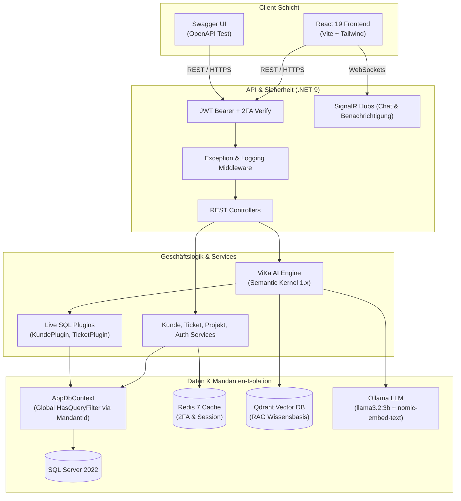

# 🌟 Vista.Core — Multi-Tenant CRM & Local AI SaaS Backend

[](https://github.com/Daddarios/vista-saas-backend/actions/workflows/ci.yml)


**Sprache auswählen / Choose Language / Dil Seçin:**  
[🇩🇪 Deutsch](#-deutsch) &nbsp;•&nbsp; [🇬🇧 English](#-english) &nbsp;•&nbsp; [🇹🇷 Türkçe](#-türkçe)

---

<a id="-deutsch"></a>
## 🇩🇪 Deutsch

**Vista.Core** ist ein mandantenfähiges (Multi-Tenant) **CRM- und SaaS-Backend** für kleine und mittlere Unternehmen (KMU). Es basiert auf **.NET 9 Web API** und ermöglicht die Verwaltung von Kunden, Projekten, Support-Tickets, Echtzeit-Kommunikation und Zahlungsabläufen.  
Besonderes Alleinstellungsmerkmal ist **ViKa**, ein DSGVO-konformer, vollständig **lokal laufender KI-Assistent (RAG)**, der sensible Unternehmensdaten niemals an externe Cloud-Anbieter (wie OpenAI) überträgt.

---

### 🎯 Geschäftsnutzen & Kernziel
Viele bestehende CRM-Systeme leiten Unternehmensdaten an Drittanbieter-Clouds weiter. In regulierten Branchen (Banken, Versicherungen, Recht) stellt dies ein erhebliches Sicherheits- und Compliance-Risiko dar.

**Vista.Core löst dieses Problem durch zwei fundamentale Architekturprinzipien:**
1. **Strikte Mandantenisolierung:** Daten verschiedener Unternehmen sind auf Datenbankebene vollständig getrennt; ein Mandant kann niemals die Daten eines anderen Mandanten einsehen.
2. **100% Lokale KI (ViKa):** RAG (Retrieval-Augmented Generation) läuft autark über lokale Ollama- und Vektor-Container.

---

### 🏗️ Architekturübersicht



---

### 📂 Projektstruktur (Clean Architecture)

```text
Vista.Core/
├── Controllers/              # REST Endpunkte (Kunde, Ticket, Auth, Chat, VikaAdmin etc.)
├── Services/                 # Geschäftslogik
│   ├── ChatBot/              # ViKa AI Assistent, RAG Suche, Input/Output Filter
│   ├── JwtService.cs         # Token-Generierung & Refresh Token Rotation
│   ├── ZweiFaktorService.cs  # Redis-basiertes 2FA OTP Management
│   ├── FileStorageService.cs # Sicherer Dateiupload mit Path-Traversal-Schutz
│   └── EmailService.cs       # Vorlagenbasierter E-Mail- & 2FA-Service
├── Data/                     # Datenzugriffsschicht
│   ├── AppDbContext.cs       # EF Core DbContext & Strikter Mandanten-Query-Filter
│   └── DataSeeder.cs         # Automatische Initialisierung von Admin & Demo-Daten
├── Models/                   # Entitäten
│   ├── Base/
│   │   ├── BasisEntity.cs    # Id, ErstelltAm, IstGeloescht (Soft Delete)
│   │   └── MandantEntity.cs  # Guid MandantId (Multi-Tenant Basisklasse)
│   ├── Kunde.cs, Ticket.cs, Projekt.cs, Benutzer.cs, Bericht.cs ...
├── Plugins/                  # Semantic Kernel Plugins (Live SQL Datenbank-Abfragen)
│   ├── KundePlugin.cs        # kunde_suchen, kunde_anzahl, kunde_details
│   ├── TicketPlugin.cs       # offene_tickets, ticket_statistik, ticket_suchen
│   └── ProjektPlugin.cs      # projekt_suchen, projekt_anzahl
├── Hubs/                     # SignalR Hubs (ChatHub, VikaChatBotHub, BenachrichtigungHub)
├── DTOs/                     # Request- & Response-Objekte
├── Validators/               # FluentValidation Validierungsregeln
└── Program.cs                # DI-Container, Middleware Pipeline & Konfiguration
```

---

### 🛡️ Mandantenisolierung auf AppDbContext-Ebene

Die Datensicherheit wird nicht durch fehleranfällige manuelle Controller-Prüfungen geregelt, sondern direkt im ORM (`AppDbContext`):

```csharp
// AppDbContext.cs
protected override void OnModelCreating(ModelBuilder modelBuilder)
{
    base.OnModelCreating(modelBuilder);

    foreach (var entityType in modelBuilder.Model.GetEntityTypes()
                 .Where(t => typeof(MandantEntity).IsAssignableFrom(t.ClrType)))
    {
        modelBuilder.Entity(entityType.ClrType).HasQueryFilter(
            e => _currentMandantId != null && EF.Property<Guid>(e, "MandantId") == _currentMandantId);
    }
}
```
* **Garantie:** Bei jeder Datenbankabfrage (`_db.Kunden.ToListAsync()`) fügt EF Core automatisch `WHERE MandantId = '...'` ein.
* Ohne gültigen MandantId-Claim liefert das System **0 Datensätze** zurück; Datenlecks sind ausgeschlossen.

---

### 🔄 Ablaufbeispiel: Kundenerstellung (Customer Creation Flow)

```text
[1. Client Request]
  POST /api/Kunde  |  Header: Authorization: Bearer <JWT_TOKEN>
  Body: { "unternehmen": "Muster GmbH", "email": "info@muster.de" }
          │
          ▼
[2. Auth Middleware]
  JWT wird validiert ➔ "MandantId"-Claim wird aus dem Token extrahiert.
          │
          ▼
[3. FluentValidation]
  KundeRequestDtoValidator prüft Format & Pflichtfelder.
          │
          ▼
[4. Controller]
  MandantId wird der Entität zugewiesen: kunde.MandantId = mandantId.Value;
          │
          ▼
[5. AppDbContext]
  Entität wird in SQL Server gespeichert.
          │
          ▼
[6. Künftige Leseabfragen]
  Global Query Filter garantiert, dass nur Mandant A diese Daten abrufen kann.
```

---

### 🚀 Schnellstart (Docker)

```bash
git clone https://github.com/Daddarios/vista-saas-backend.git
cd vista-saas-backend
cp .env.example .env
docker compose up -d --build
```

* **Swagger UI:** `http://localhost:8080/swagger`
* **Standard-Zugangsdaten:** E-Mail: `admin@vista.local` | Passwort: `Test123!` | Rolle: `SuperAdmin`

---

### 🧪 6 Sicherheits- & Isolationstests (xUnit)
```bash
dotnet test Vista.Tests/Vista.Tests.csproj
```
* ✅ **Test 1:** Mandanten-Isolation bei Listenabfragen (`GetAll`).
* ✅ **Test 2:** Zugriff auf fremde Datensatz-IDs liefert `404 Not Found`.
* ✅ **Test 3:** Fremde Entitäten können weder geändert noch gelöscht werden.
* ✅ **Test 4:** Anonyme Abfragen ohne Claim liefern 0 Datensätze.
* ✅ **Test 5:** 2FA-Validierung und Session-Generierung.
* ✅ **Test 6:** Rollenbasierte Zugriffsbeschränkungen (`NurLesen`).

---

<a id="-english"></a>
## 🇬🇧 English

**Vista.Core** is a multi-tenant **CRM and SaaS backend** engineered for small and medium-sized enterprises (SMEs) running on **.NET 9 Web API**. It manages customers, projects, support tickets, real-time messaging, and subscription workflows.  
Its hallmark feature is **ViKa**, a GDPR-compliant, **fully offline AI assistant (RAG)** that never sends confidential business data to external cloud providers (such as OpenAI).

---

### 🎯 Business Value & Core Objective
Standard SaaS CRMs often stream confidential records to third-party AI endpoints. In regulated sectors (finance, healthcare, legal), this is a critical compliance violation.

**Vista.Core eliminates this risk with two core architectural pillars:**
1. **Strict Tenant Isolation:** Data isolation is enforced at the database layer; Tenant A can never view or modify Tenant B's data.
2. **100% On-Premise AI (ViKa):** RAG queries execute locally against self-hosted Ollama and vector containers.

---

### 📂 Clean Architecture Project Structure

```text
Vista.Core/
├── Controllers/              # REST Endpoints (Kunde, Ticket, Auth, Chat, VikaAdmin etc.)
├── Services/                 # Core Business Services
│   ├── ChatBot/              # ViKa AI Assistant, RAG Engine, Input/Output Filters
│   ├── JwtService.cs         # JWT Generation & Refresh Token Rotation
│   ├── ZweiFaktorService.cs  # Redis-backed 2FA OTP Service
│   ├── FileStorageService.cs # Path-traversal-safe file upload engine
│   └── EmailService.cs       # Templated notification & 2FA email service
├── Data/                     # Data Layer
│   ├── AppDbContext.cs       # EF Core DbContext & Global Multi-Tenant Query Filter
│   └── DataSeeder.cs         # Automated seed of Admin, Demo Tenant & Sample Data
├── Models/                   # Domain Entities (Base & Tenant Entities)
├── Plugins/                  # Semantic Kernel Plugins (Live SQL Database Tooling)
├── Hubs/                     # SignalR Real-Time Hubs (Chat, Notifications, AI Stream)
├── DTOs/                     # Request & Response Contracts
├── Validators/               # FluentValidation Rules
└── Program.cs                # DI Container & Middleware Pipeline
```

---

### 🛡️ AppDbContext-Level Tenant Isolation

Data isolation is never delegated to fragile manual `if` checks in controllers. It is enforced globally in the ORM:

```csharp
// AppDbContext.cs
protected override void OnModelCreating(ModelBuilder modelBuilder)
{
    base.OnModelCreating(modelBuilder);

    foreach (var entityType in modelBuilder.Model.GetEntityTypes()
                 .Where(t => typeof(MandantEntity).IsAssignableFrom(t.ClrType)))
    {
        modelBuilder.Entity(entityType.ClrType).HasQueryFilter(
            e => _currentMandantId != null && EF.Property<Guid>(e, "MandantId") == _currentMandantId);
    }
}
```
* **Guarantee:** Every LINQ query (`_db.Kunden.ToListAsync()`) automatically executes with `WHERE MandantId = '...'`.
* Unauthenticated requests or missing claims return **0 records**, mathematically preventing cross-tenant data leaks.

---

### 🔄 Customer Creation Flow

```text
[1. Client Request]
  POST /api/Kunde  |  Header: Authorization: Bearer <JWT_TOKEN>
  Body: { "unternehmen": "TechBank AG", "email": "info@techbank.de" }
          │
          ▼
[2. Auth Middleware]
  JWT is decoded ➔ "MandantId" claim is extracted from user identity.
          │
          ▼
[3. FluentValidation]
  KundeRequestDtoValidator validates required fields and formats.
          │
          ▼
[4. Controller]
  MandantId is set to current tenant: kunde.MandantId = mandantId.Value;
          │
          ▼
[5. AppDbContext]
  Entity is saved to Microsoft SQL Server.
          │
          ▼
[6. Subsequent Queries]
  Global query filter ensures only the creator tenant can read the customer.
```

---

### 🚀 Quick Start (Docker)

```bash
git clone https://github.com/Daddarios/vista-saas-backend.git
cd vista-saas-backend
cp .env.example .env
docker compose up -d --build
```

* **Swagger UI:** `http://localhost:8080/swagger`
* **Default Credentials:** Email: `admin@vista.local` | Password: `Test123!` | Role: `SuperAdmin`

---

### 🧪 6 Security & Isolation Tests (xUnit)
```bash
dotnet test Vista.Tests/Vista.Tests.csproj
```
* ✅ **Test 1:** List query tenant data isolation (`GetAll`).
* ✅ **Test 2:** Direct ID lookup for another tenant's entity returns `404 Not Found`.
* ✅ **Test 3:** Cross-tenant updates and deletions are strictly blocked.
* ✅ **Test 4:** Anonymous/claimless queries return zero records.
* ✅ **Test 5:** 2FA validation and JWT session generation.
* ✅ **Test 6:** Role-based access control enforcement (`NurLesen`).

---

<a id="-türkçe"></a>
## 🇹🇷 Türkçe

**Vista.Core**, küçük ve orta ölçekli işletmeler (KOBİ'ler) için geliştirilmiş, kurumsal veri gizliliğini (GDPR / KVKK) merkeze alan **çok kiracılı (multi-tenant) CRM & SaaS Backend** çözümüdür.  
Müşteri, proje, destek bileti (ticket), gerçek zamanlı iletişim ve abonelik süreçlerini yönetirken; şirket içi verilerini **hiçbir dış API'ye (OpenAI vb.) sızdırmadan**, tamamen yerel sunucuda çalışan **ViKa AI (RAG)** asistanı ile güçlendirir.

---

### 🎯 İş Problemi ve Hedef Kitle
Piyasadaki birçok CRM çözümü, müşteri verilerini üçüncü taraf yapay zeka bulutlarına gönderir. Bankacılık, sigortacılık, sağlık ve hukuk gibi regülasyona tabi sektörlerde bu kabul edilemez bir veri güvenliği ihlalidir.

**Vista.Core, bu problemi iki temel mimari kural ile çözer:**
1. **Mutlak Kiracı İzolasyonu:** Her firmanın verisi veritabanı seviyesinde ayrıştırılır; bir firmanın kullanıcısı diğer firmanın verisine asla erişemez.
2. **%100 Yerel Yapay Zeka (ViKa):** Şirket verileri üzerinde semantik arama (RAG) yapan AI modeli, tamamen yerel Ollama container'ı üzerinde çalışır.

---

### 📂 Proje Dizin Yapısı (Clean Architecture)

```text
Vista.Core/
├── Controllers/              # REST API Endpoint'leri (Kunde, Ticket, Auth, Chat, VikaAdmin vb.)
├── Services/                 # İş mantığı servisleri
│   ├── ChatBot/              # ViKa AI Asistanı, RAG Arama, ChatInput/Output Filtreleri
│   ├── JwtService.cs         # Token üretimi ve Refresh Token rotasyonu
│   ├── ZweiFaktorService.cs  # Redis destekli 2FA OTP yönetimi
│   ├── FileStorageService.cs # Güvenli dosya yükleme (Path traversal korumalı)
│   └── EmailService.cs       # Şablonlu bildirim & 2FA e-posta servisi
├── Data/                     # Veri erişim katmanı
│   ├── AppDbContext.cs       # EF Core DbContext & Global Tenant Query Filter
│   └── DataSeeder.cs         # Varsayılan admin, demo kiracı ve veri tohumlama
├── Models/                   # Entity modelleri
├── Plugins/                  # Semantic Kernel Eklentileri (Canlı SQL sorgu araçları)
├── Hubs/                     # Gerçek zamanlı SignalR Hub'ları (ChatHub, VikaChatBotHub)
├── DTOs/                     # İstek ve yanıt veri transfer nesneleri (Request/Response DTOs)
├── Validators/               # FluentValidation kural sınıfları
└── Program.cs                # DI Container, Middleware Pipeline ve Konfigürasyon
```

---

### 🛡️ AppDbContext Seviyesinde Tenant İzolasyonu

Vista.Core'da tenant güvenliği **asla controller seviyesindeki manuel if kontrollerine bırakılmaz**. Güvenlik, doğrudan ORM (`AppDbContext`) seviyesinde garanti edilir:

```csharp
// AppDbContext.cs
protected override void OnModelCreating(ModelBuilder modelBuilder)
{
    base.OnModelCreating(modelBuilder);

    foreach (var entityType in modelBuilder.Model.GetEntityTypes()
                 .Where(t => typeof(MandantEntity).IsAssignableFrom(t.ClrType)))
    {
        modelBuilder.Entity(entityType.ClrType).HasQueryFilter(
            e => _currentMandantId != null && EF.Property<Guid>(e, "MandantId") == _currentMandantId);
    }
}
```
* **Sonuç:** Kullanıcı bir SQL sorgusu attığında (`_db.Kunden.ToListAsync()`), EF Core arka planda otomatik olarak `WHERE MandantId = '...'` filtresini sorguya enjekte eder. 
* Token taşımayan veya MandantId claim'i bulunmayan bir istek atılırsa, sistem **sıfır kayıt** döner; veri sızıntısı engellenir.

---

### 🔄 Müşteri Oluşturma Akışı (Customer Creation Flow)

```text
[1. İstemci İsteği]
  POST /api/Kunde  |  Header: Authorization: Bearer <JWT_TOKEN>
  Body: { "unternehmen": "TechBank AG", "email": "info@techbank.de" }
          │
          ▼
[2. Authentication & Claims Middleware]
  JWT Token çözülür ➔ ClaimsPrincipal içerisinden "MandantId" çıkarılır.
          │
          ▼
[3. FluentValidation]
  KundeRequestDtoValidator çalışır (Format ve zorunlu alanlar denetlenir).
          │
          ▼
[4. Controller]
  Aktif kullanıcının MandantId'si atanır: kunde.MandantId = mandantId.Value;
          │
          ▼
[5. AppDbContext]
  Kayıt SQL Server veritabanına yazılır.
          │
          ▼
[6. Sonraki Okuma İstekleri]
  Global Query Filter sayesinde sadece ilgili kiracı bu kaydı okuyabilir.
```

---

### 🚀 Hızlı Başlangıç (Docker)

```bash
git clone https://github.com/Daddarios/vista-saas-backend.git
cd vista-saas-backend
cp .env.example .env
docker compose up -d --build
```

* **Swagger API UI:** `http://localhost:8080/swagger`
* **Hazır Test Hesabı:** E-posta: `admin@vista.local` | Şifre: `Test123!` | Rol: `SuperAdmin`

---

### 🧪 6 Adet Güvenlik ve İzolasyon Testi (xUnit)
```bash
dotnet test Vista.Tests/Vista.Tests.csproj
```
* ✅ **Test 1:** Liste sorgusunda kiracı veri izolasyonu (`GetAll`).
* ✅ **Test 2:** Doğrudan ID ile başka kiracının verisine erişim engeli (`GetById` ➔ `404`).
* ✅ **Test 3:** Çapraz kiracı güncelleme ve silme engeli (`PUT`/`DELETE` ➔ `404`).
* ✅ **Test 4:** Token taşımayan anonim/filtresiz isteklerde 0 kayıt dönmesi.
* ✅ **Test 5:** 2FA doğrulama ve JWT oturum üretim akışı.
* ✅ **Test 6:** `NurLesen` (Salt Okunur) rolünün veri değiştirme kısıtlaması.

---

## 💻 Teknoloji Yığını (Tech Stack)

| Katman | Teknoloji |
| :--- | :--- |
| **Backend** | .NET 9 · ASP.NET Core Web API · C# 13 |
| **Veritabanı & ORM** | Microsoft SQL Server 2022 · Entity Framework Core 9 |
| **Kimlik & Güvenlik** | ASP.NET Core Identity · JWT · 2FA (Redis OTP) |
| **Gerçek Zamanlı** | SignalR (Chat & Bildirimler) |
| **Yapay Zeka (AI/RAG)** | Semantic Kernel 1.x · Kernel Memory · Ollama (`llama3.2:3b`, `nomic-embed-text`) · Qdrant |
| **Doğrulama & Günlük** | FluentValidation · Serilog |
| **Test & DevOps** | xUnit · Docker Compose · GitHub Actions CI/CD |

---

## 📄 Lisans
Bu proje kurumsal kullanım ve teknik vitrin için hazırlanmıştır. MIT Lisansı ile korunmaktadır.
